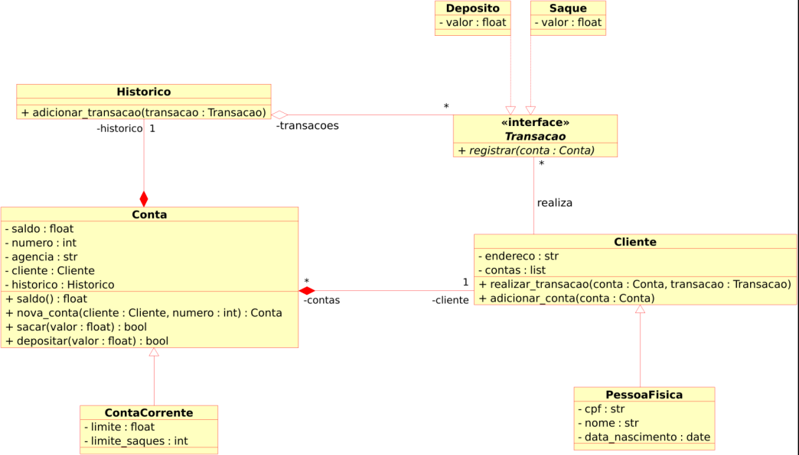

# Modelando o Sistema Bancário em POO com Python

Desafio introdutório de Python para criar um sistema bancário com as operações: sacar, depositar e visualizar extrato.

- **Inheritance** (Herança): ContaCorrente é filha (extende) da classe Conta, assim como PessoaFisica é filha da classe Cliente.
- **Composition** (Composição: dependência): Historico e Cliente compõem a classe Conta:
  - Cada Conta é composta por apenas uma Historico (em historico);
  - Cada Conta é composta por exatamente uma Cliente (em cliente), mas cada Cliente pode ter várias Contas (em contas);
- **Aggregation** (Agregação: independencia): Historico é agregado à Transacao, que é implementada por Deposito e Saque.
  - Uma Historico possui zero ou mais Transacao (Deposito e/ou Saque);
- **Association** (Associação): A associação entre Cliente e Transação (Deposito/Saque) é de que Cliente pode realizar zero ou mais Deposito e/ou Saque.

- Herança (**Inheritance**):
  - A classe `ContaCorrente` estende a classe `Conta`, assim como a classe PessoaFisica é uma filha da classe `Cliente`. Isso significa que `ContaCorrente` e `PessoaFisica` herdam características e comportamentos da classe pai.
- Composição (**Composition**):
  - A classe `Conta` é composta por duas partes essenciais: Histórico e `Cliente`.
  - Cada `Conta` possui uma instância única de Histórico (em “historico”).
  - Cada `Conta` também está associada a exatamente uma instância de `Cliente` (em “cliente”), mas cada `Cliente` pode ter várias contas (em “contas”).
- Agregação (**Aggregation**):
  - A classe `Histórico` está agregada à classe `Transação`.
  - Isso significa que uma instância de `Histórico` pode estar associada a zero ou mais instâncias de `Transação` (como Depósito e/ou Saque).
- Associação (**Association**):
  - A associação entre `Cliente` e `Transação` (Depósito/Saque) indica que um `Cliente` pode realizar zero ou mais Depósitos e/ou Saques.
