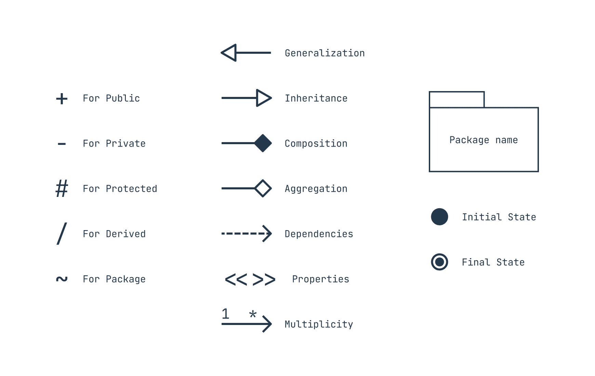

# Programação Orientada a Objetos com Python

## Intro

O paradigma de programação orientada a objetos estrutura o código abstraindo problemas em objetos do mundo real, facilitando o entendimento do código e tornando-o mais modular e extensível.

Uma **classe** define as características e comportamentos de um objeto. Os **objetos** são utilizáveis e possuem as características e comportamentos que foram definidos nas classes.

- `self` explícito em Python e `this` implícito em JavaScript são usados para referenciar à instância do objeto atual dentro de um método ou função.
  - Em Python, é uma referência à instância do objeto atual dentro de um método de classe.
  - Em JavaScript, é uma referência ao objeto atual dentro de uma função ou método.

Método **construtor** sempre é executado quando uma nova instância da classe é criada. É nele que se inicializa o estado do objeto. Em Python, utiliza-se o `__init__`.

Método destrutor sempre é executado quando uma instância (objeto) é destruída. Não são tão necessários quanto em C++ pela presença de um coletor de lixo do Python. Em Python, utiliza-se o `__del__` (é um finalizador).

## Herança

Em programação, herança é a capacidade de uma classe filha derivar ou herdar características e comportamentos da classe pai (base).

`class Filha(Pai1, Pai2, Pai3, Pai4,...)`

## Encapsulamento

Encapsulamento descreve a ideia de agrupar dados e métodos em uma unidade. Isso impõe restrições ao acesso direto aos mesmos e pode evitar modificação acidental de dados.



[UML Class Diagram How to Make](https://slickplan.com/blog/how-to-make-a-uml-diagram)

[UML Class Diagram Tutorial](https://www.visual-paradigm.com/guide/uml-unified-modeling-language/uml-class-diagram-tutorial/)

Como em Python não existem palavras reservadas para definir nível de acesso, usa-se convenções no nome do recurso para sinalizar se o mesmo deve ser tratado como **público** (acessado fora da classe) ou **privado** (acessado somente pela classe). Assim, uma variável/método iniciado por underline deve ser tratado como privado.

Com o decorador `@property`pode-se criar atributos/propriedades gerenciados (adiciona comportamento personalizado) nas classes.

## Poliformismo

Na programação, polimorfismo implica o mesmo nome de função sendo utilizado para tipos diferentes.

Na herança, a classe filha herda métodos da classe pai, e esses podem ser modificados para melhor se adequar à classe filha.

```python
len("string")
len([1,2,3,4,5])
```

## Instâncias e Interfaces

Métodos e variáveis/atributos **de classe** estão ligados à classe e não ao objeto/instância. Eles têm acesso ao estado da classe, pois recebem um parâmetro que aponta para a classe e não para a instância do objeto (`self`).

Métodos de classe são usados para criar métodos de fábrica (construtores alternativos). Para criar um método de classe:

```python
class X:
  @classmethod
  def function(cls, val1, val2, val3):
    ...
```

**Métodos estáticos** não precisam de parâmetros específicos (`self` ou `cls`) e podem ser chamados diretamente da classe ou da instância, mas não possuem acesso aos atributos da classe. Para criar um método estático:

```python
class X:
  @staticmethod
  def function(val1, val2, val3):
    ...
```

**Interfaces** definem o que uma classe deve fazer, mas não como, funcionando como um contrato onde são declarados os métodos e suas respectivas assinaturas.

## Classes Abstratas

Classe abstrata é um tipo de classe que não pode ser instanciada, apenas herdada. Se faz importante quando uma classe pai/base não precisará ser instanciada.

O Python utiliza o módulo **abc** para definir classes abstratas por meio de decoradores de métodos (`@abstractmethod`).
